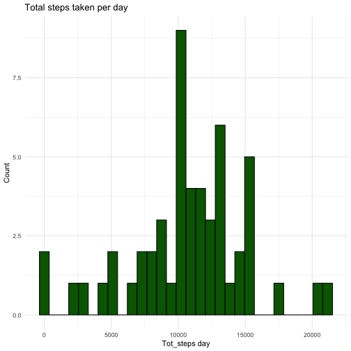
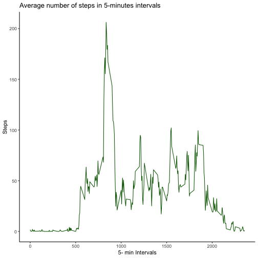
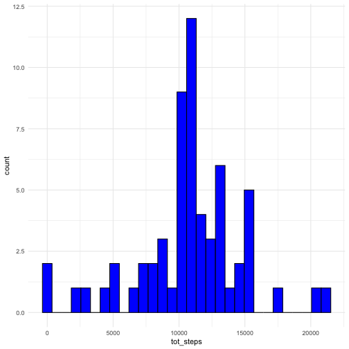
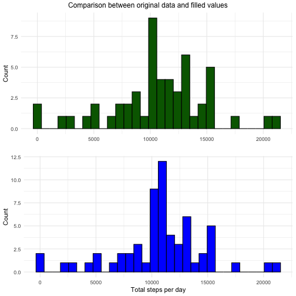
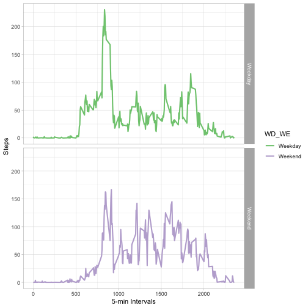

## Loading and preprocessing the data 

**Process/transform the data (if necessary) for your analysis**


``` r
data<- read.csv("activity.csv")
steps <- na.omit(data)
head(steps)
```

```
##     steps       date interval
## 289     0 2012-10-02        0
## 290     0 2012-10-02        5
## 291     0 2012-10-02       10
## 292     0 2012-10-02       15
## 293     0 2012-10-02       20
## 294     0 2012-10-02       25
```
## What is mean total number of steps taken per day?

**- Calculate the total number of steps taken per day**

**- Make a histogram of the total number of steps taken each day**

**- Calculate and report the mean and median of the total number of steps taken per day**


``` r
library(dplyr)
steps2 <- steps %>% group_by(date) %>% summarize(tot_steps=sum(steps))
head(steps2)
```

```
## # A tibble: 6 × 2
##   date       tot_steps
##   <chr>          <int>
## 1 2012-10-02       126
## 2 2012-10-03     11352
## 3 2012-10-04     12116
## 4 2012-10-05     13294
## 5 2012-10-06     15420
## 6 2012-10-07     11015
```

``` r
library(ggplot2)
histogram <- ggplot(steps2, aes(tot_steps))
histogram + geom_histogram(color="black", fill="darkgreen", bins= 30) + theme_minimal() + labs(title= "Total steps taken per day", x= "Tot_steps day", y= "Count")
```



``` r
summarise(steps2, median= median(tot_steps), mean= mean(tot_steps))
```

```
## # A tibble: 1 × 2
##   median   mean
##    <int>  <dbl>
## 1  10765 10766.
```

## What is the average daily activity pattern?

**- Make a time series plot of the 5-minute interval (x-axis) and the average number of steps taken, averaged across all days(y-axis)**

**- Which 5-min interval, on average across all the days in the dataset, contains the maximum number of steps?**


``` r
interval_5<- steps %>% group_by(interval) %>% summarize(mean= mean(steps))
head(interval_5)
```

```
## # A tibble: 6 × 2
##   interval   mean
##      <int>  <dbl>
## 1        0 1.72  
## 2        5 0.340 
## 3       10 0.132 
## 4       15 0.151 
## 5       20 0.0755
## 6       25 2.09
```

``` r
time_series<- ggplot(interval_5, aes(interval,mean))
time_series+ geom_line(color="darkgreen")+ theme_classic() + labs(title="Average number of steps in 5-minutes intervals", y="Steps", x="5- min Intervals")
```



``` r
interval_5[which.max(interval_5$mean),]
```

```
## # A tibble: 1 × 2
##   interval  mean
##      <int> <dbl>
## 1      835  206.
```

## Imputing missing values

**- Calculate and report the number of missin values in the dataset**

**- Devise a strategy for filling in all of the missing values in the dataset. Create a new dataset that is equal to the original dataset but with the missing data filled in**

 ` I have filled in the missing values with the mean for that 5-minute interval `
 
 **- Make a histogram of the total number of steps taken each day**
 
 **- Calculate and report the mean and median total number of steps taken per day**
 
 **- Do these values differ from the estimates from the first part of the assignment? What is the impact of imputing missing data on the estimates of the total daily number of steps?**
 
 ` The median is slightely higher in the new dataset, while the mean remains the same`
 ` The difference between the datasets can be appreciated in the two histogram:` 
 ` in green the histogram of the dataset W/O missing values; in blue the histogram of the datset with filled in values`


``` r
data2 <- is.na(data)
colSums(data2)
```

```
##    steps     date interval 
##     2304        0        0
```

``` r
new_dataset <- merge(data, interval_5, by="interval")
head(new_dataset)
```

```
##   interval steps       date     mean
## 1        0    NA 2012-10-01 1.716981
## 2        0     0 2012-11-23 1.716981
## 3        0     0 2012-10-28 1.716981
## 4        0     0 2012-11-06 1.716981
## 5        0     0 2012-11-24 1.716981
## 6        0     0 2012-11-15 1.716981
```

``` r
dataset <- new_dataset %>% mutate(steps= coalesce(steps, mean)) %>% select("steps", "date", "interval") %>% arrange(date)
head(dataset)
```

```
##       steps       date interval
## 1 1.7169811 2012-10-01        0
## 2 0.3396226 2012-10-01        5
## 3 0.1320755 2012-10-01       10
## 4 0.1509434 2012-10-01       15
## 5 0.0754717 2012-10-01       20
## 6 2.0943396 2012-10-01       25
```

``` r
steps_new <- dataset %>% group_by(date) %>% summarize(tot_steps=sum(steps))
head(steps_new)
```

```
## # A tibble: 6 × 2
##   date       tot_steps
##   <chr>          <dbl>
## 1 2012-10-01    10766.
## 2 2012-10-02      126 
## 3 2012-10-03    11352 
## 4 2012-10-04    12116 
## 5 2012-10-05    13294 
## 6 2012-10-06    15420
```

``` r
hist_new<- ggplot(steps_new, aes(tot_steps))
hist_new + geom_histogram(color="black", fill="blue", bins= 30) + theme_minimal()
```



``` r
summarise(steps_new, median= median(tot_steps), mean= mean(tot_steps))
```

```
## # A tibble: 1 × 2
##   median   mean
##    <dbl>  <dbl>
## 1 10766. 10766.
```

``` r
library(gridExtra)
plot1 <- histogram + geom_histogram(color="black", fill="darkgreen", bins= 30) + theme_minimal() + labs(x="", y="Count")
plot2 <- hist_new + geom_histogram(color="black", fill="blue", bins= 30) + theme_minimal() + labs(x= "Total steps per day", y="Count")
grid.arrange(plot1, plot2, top= "Comparison between original data and filled values")
```



## Are there differences in activity patterns between weekdays and weekends?

Use the dataset with the filled-in missing values for this part.

**- Create a new factor variable in the dataset with two levels – “weekday” and “weekend” indicating whether a given date is a weekday or weekend day**

`I called the new variable WD_WE`

**- Make a panel plot containing a time series plot (i.e. of the 5-minute interval (x-axis) and the average number of steps taken, averaged across all weekday days or weekend days (y-axis) **

`Weekday days are in green and Weekend days are in purple`


``` r
dataset$date= as.Date(as.character(dataset$date))
head(dataset)
```

```
##       steps       date interval
## 1 1.7169811 2012-10-01        0
## 2 0.3396226 2012-10-01        5
## 3 0.1320755 2012-10-01       10
## 4 0.1509434 2012-10-01       15
## 5 0.0754717 2012-10-01       20
## 6 2.0943396 2012-10-01       25
```

``` r
class(dataset$date)
```

```
## [1] "Date"
```

``` r
dataset_days <- dataset %>% mutate(weekday=weekdays(date))
head(dataset_days)
```

```
##       steps       date interval weekday
## 1 1.7169811 2012-10-01        0  Monday
## 2 0.3396226 2012-10-01        5  Monday
## 3 0.1320755 2012-10-01       10  Monday
## 4 0.1509434 2012-10-01       15  Monday
## 5 0.0754717 2012-10-01       20  Monday
## 6 2.0943396 2012-10-01       25  Monday
```

``` r
dataset_days$WD_WE <- as.factor(ifelse(dataset_days$weekday== "Saturday" | dataset_days$weekday== "Sunday", "Weekend", "Weekday"))
head(dataset_days)
```

```
##       steps       date interval weekday   WD_WE
## 1 1.7169811 2012-10-01        0  Monday Weekday
## 2 0.3396226 2012-10-01        5  Monday Weekday
## 3 0.1320755 2012-10-01       10  Monday Weekday
## 4 0.1509434 2012-10-01       15  Monday Weekday
## 5 0.0754717 2012-10-01       20  Monday Weekday
## 6 2.0943396 2012-10-01       25  Monday Weekday
```

``` r
average_WD_WE <- dataset_days %>% select("steps", "interval", "WD_WE") %>% group_by(interval, WD_WE) %>% summarize(mean= mean(steps))
```

```
## `summarise()` has grouped output by 'interval'. You can override using the `.groups` argument.
```

``` r
head(average_WD_WE)
```

```
## # A tibble: 6 × 3
## # Groups:   interval [3]
##   interval WD_WE     mean
##      <int> <fct>    <dbl>
## 1        0 Weekday 2.25  
## 2        0 Weekend 0.215 
## 3        5 Weekday 0.445 
## 4        5 Weekend 0.0425
## 5       10 Weekday 0.173 
## 6       10 Weekend 0.0165
```

``` r
plot_days <- ggplot(average_WD_WE, aes(colour=WD_WE, x=interval, y=mean)) + geom_line(linewidth=1) + facet_grid(WD_WE~.) + theme_light()
plot_days+ scale_color_brewer(palette = "Accent")+ labs(y="Steps", x="5-min Intervals")
```


